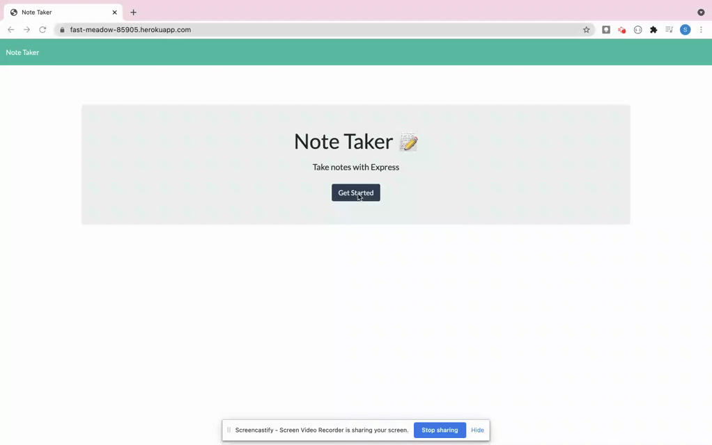

# Note Taker

## Description

This is a server based note taking app.

## Table of Contents:

* [Installation](#installation)
* [Usage](#usage)
* [Tests](#tests)
* [Packages](#packages)
* [Demo](#demo)

## Installation
Click [here](https://fast-meadow-85905.herokuapp.com/) to access the app. (No installation needed.)

## Usage:
* Add and/or delete your notes.
* Check out [demo](#demo).

## Tests:
Testing not available.

## Packages:
* [Express](https://expressjs.com/)
* [Nodemon](https://www.npmjs.com/package/nodemon)

## Demo:

## Thank you
### Author Details
**Name:** Sonali Pandey

**GitHub:** [sonali-pandey](https://github.com/sonali-pandey)
